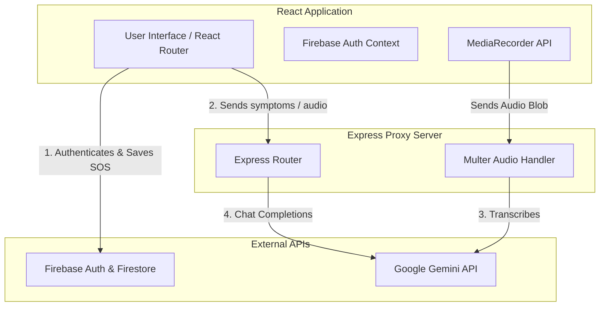

# Shurokkha AI (সুরক্ষা AI)

> **Bengali Health & Emergency Companion**
>
> A state-of-the-art web application offering medical advice, emergency SOS support, and disaster alerts in Bengali. Powered by React, Vite, Node.js, Express, Firebase, and Google Gemini.

---

## 🏗️ System Architecture

Shurokkha AI is architected with a decoupled frontend and a secure backend proxy server to keep API secrets safe.



---

## 🚀 Key Features

* **💬 AI Health Assistant**: Submit symptoms in Bengali or English and receive concise, safe, first-aid style recommendations in Bengali.
* **🎙️ Voice Support**: Speech recognition and WebM audio recording transcription powered by Google Gemini 1.5 Flash.
* **🆘 Emergency SOS**: Share GPS coordinates with a single tap, storing request logs securely in Firestore.
* **🔒 Secure Proxying**: Sanitized server-side request proxying to keep the Gemini API keys hidden from client exposure.

---

## 📂 Project Structure

```
ShurokkhaAI/
├── public/                 # Static assets for the application
├── server/                 # Express backend proxy
│   ├── .env.example        # Reference file for backend environment configuration
│   ├── index.js            # Express API endpoints & middleware
│   └── package.json        # Node.js backend dependencies
├── src/                    # React frontend application
│   ├── components/         # Reusable layouts (Navbar, Footer, etc.)
│   ├── contexts/           # Authentication state context
│   ├── firebase/           # Configuration files and connection to Firebase SDK
│   ├── pages/              # Route views (Home, Dashboard, Emergency, SymptomChecker)
│   ├── utils/              # Helper modules (AI integrations, Audio Recorder)
│   ├── App.jsx             # Root layout & routing configuration
│   └── index.jsx           # Main entry point
├── index.html              # Vite entry page
├── tailwind.config.js      # CSS configuration for Tailwind
└── package.json            # React app configuration and scripts
```

---

## 📋 Prerequisites

Before running the application, make sure you have the following installed on your machine:
* **Node.js** (v18.x or higher)
* **npm** (v9.x or higher)
* **Gemini API Key** (for symptom analysis and voice transcriptions)
* **Firebase Project** (preconfigured API keys exist, or configure your own in `src/firebase/config.js`)

---

## ⚙️ Configuration & Environment

### Backend Configuration (`server/.env`)
Create a `.env` file in the `server` directory using the table below as a guide:

| Key | Description | Default / Example |
| :--- | :--- | :--- |
| `GEMINI_API_KEY` | Your secret Gemini API Key. | `AIzaSy...` |
| `PORT` | Local port for the Express proxy server. | `3001` |

### Frontend Configuration (`.env`)
Create a `.env` file in the root directory if you want to explicitly connect the React client to the Express server:

| Key | Description | Default / Example |
| :--- | :--- | :--- |
| `REACT_APP_AI_API_URL` | Endpoint URL of the backend proxy. | `http://localhost:3001` |

### Firebase Database Setup
The app is pre-configured with a default Firebase database. To link your own Firebase project:
1. Open the [Firebase Console](https://console.firebase.google.com/) and copy your Web App configuration object.
2. Open [src/firebase/config.js](file:///g:/project/ShurokkhaAI/src/firebase/config.js) and replace the `firebaseConfig` object credentials (lines 11–19).

---

## 🛠️ Setup & Execution

### 1. Start the Backend Proxy Server

Open a terminal window and run:
```bash
# Navigate to the server directory
cd server

# Install node dependencies
npm install

# Copy the env template and configure it
cp .env.example .env

# Run in Production mode
npm start
```
The server will start listening on `http://localhost:3001`.

### 2. Start the Frontend React App

Open a second terminal window in the root directory and run:
```bash
# Install frontend dependencies
npm install

# Start the Vite development server
npm run dev
```
The frontend will start running on `http://localhost:5173/`. Open it in your web browser to start using the app.

---

## 🩹 Troubleshooting

* **`npm: command not found`**: If you get a command execution error, it means Node.js is not added to your system path. Please download Node.js from the official website and restart your terminal.
* **`Warning: GEMINI_API_KEY is not set`**: The proxy server will fail to communicate with Gemini. Ensure your `server/.env` is correctly created and contains a valid secret key.
* **Authentication or database issues**: Ensure you have a working network connection; the app requires internet access to connect with the Firebase Firestore database.
